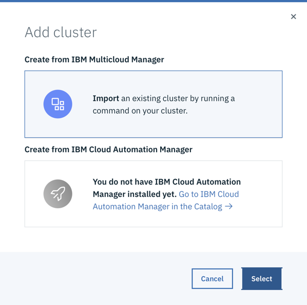
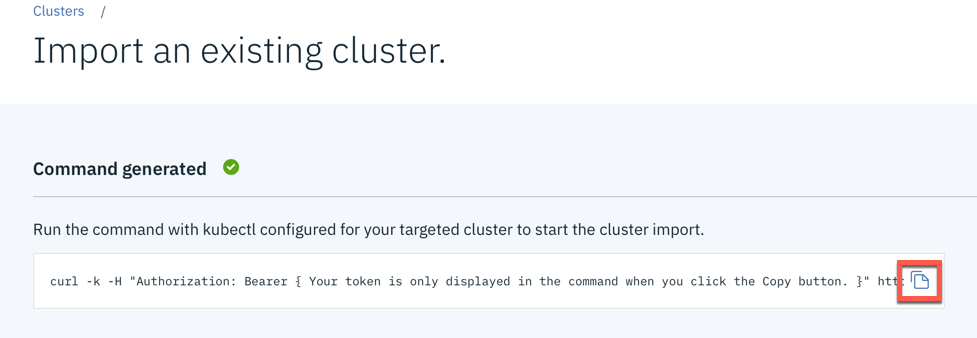
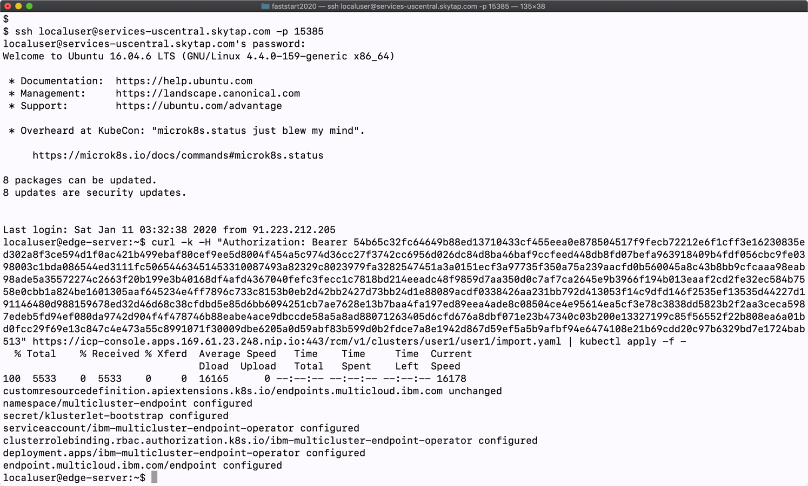

# Exercise 1 Adding a managed cluster

## Login to IBM CloudPak for Multicloud Management console

1. On you workstation open a browser and point it to https://https://icp-console.apps.169.61.23.248.nip.io

2. Login with the credentials given you by the instructors


3. Open **Menu**, then **Automate infrastructure** then **Clusters**


4. Click **Add cluster**


5. Pick the **Import** option and click **Select**



6. Provide the cluster name corresponding to your userid. Edit the **Cluster import YAML file** to uncomment ```environment``` and ```region``` clusterLabels as shown below. Disable prometheusIntegration
```
   prometheusIntegration:
     enabled: false
```


   Then click **Generate command**

7. Click the copy icon next to the generated command



8. Paste the command in the terminal window where you are logged in to the managed-cluster environment



9. Observe the multicluster-endpoint being deployed running the following command
```
kubectl get pods -n multicluster-endpoint
```
After about 2 minutes the output should look like:
```
localuser@edge-server:~$ kubectl get pods -n multicluster-endpoint
NAME                                                  READY   STATUS              RESTARTS   AGE
endpoint-appmgr-69dcf8d57c-9hcn9                      1/1     Running             0          2m42s
endpoint-component-operator-5f8c655b95-zvzdn          1/1     Running             1          3d19h
endpoint-connmgr-758f596c74-nfws6                     1/1     Running             0          2m42s
endpoint-policyctrl-5747949b95-xxzxs                  2/2     Running             0          2m42s
endpoint-search-5bd5b5885f-2phw2                      1/1     Running             0          2m42s
endpoint-svcreg-844c49fb6d-dpxrn                      1/1     Running             0          2m41s
endpoint-svcreg-coredns-667ff545d4-ct7r5              1/1     Running             1          3d19h
endpoint-topology-weave-collector-7c4d4fd6fd-x4mkz    1/1     Running             0          2m41s
endpoint-topology-weave-scope-4k9s2                   1/1     Running             1          3d19h
endpoint-topology-weave-scope-app-7954c74ddc-5mfln    2/2     Running             2          3d19h
endpoint-workmgr-54987c7fdb-9dxxn                     1/1     Running             0          2m42s
ibm-multicluster-endpoint-operator-854f9b7cbb-jscjk   1/1     Running             1          3d19h
```

10.  Go back to the browser window. Click **View Cluster** to open a cluster details. 


11.  If registration was successful you should see the similar view
    


This concludes the exercise