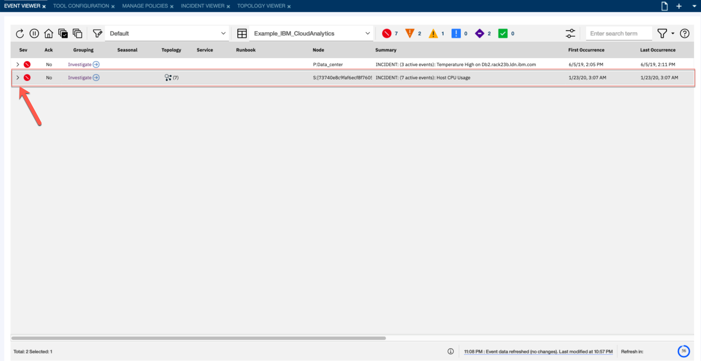
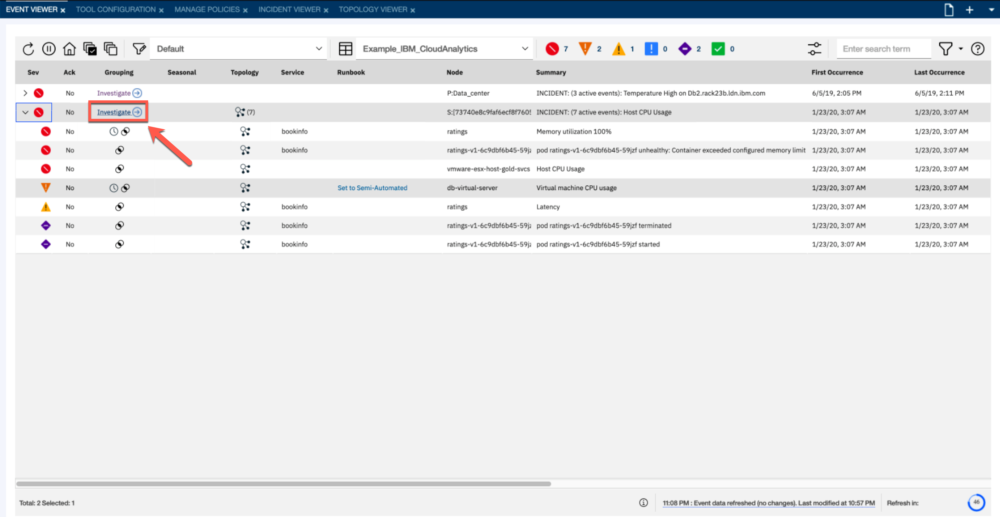

# Working with the event viewer 

[Go back to the Table of Content](../README.md)

### Imagine you are the IT operations engineer and you were just notified that the Bookinfo application is experiencing availability issues. The Bookinfo application is a Hybrid Cloud application with the front-end components hosted on a public cloud and the back-end database hosted on a on-premises infrastructure using VMWare.

### 1. You start with the event viewer. This is the place where the IT Operations team sees currently open events that are sorted by severity. IBM Netcool Operations Insights analytics has automatically grouped events that are related to the same problem.

### 2. You were alerted to manage Bookinfo service issues so let’s start by looking at the associated events. Click the > arrow on the left in the line that is related to the Book info service.

### 3. You can see that there are multiple events that were automatically correlated to the incident. Different icons in Grouping,Seasonal and Topology columns represent different correlation methods that were applied by Netcool Operations Insights. You explore them in the details in the following steps. Click the _Investigate_ link to start looking for a root cause of the service issues.

[Continue to Exercise 2](../Exercise2/README.md)
