# Investigating the incident

[Go back to the Table of Content](../README.md)

### In this section, you explore all the context information that the analytics engine that is used in Netcool Operation Insight provides to operators.

### 1. Incident viewer opens. This view is used by Operations during the incident investigation process. To understand why the events were correlated look at the Groupings column on the right side. Events that are marked under the clock icon were picked due to time-based correlation. Click the _a_ icon in the top row to see details.

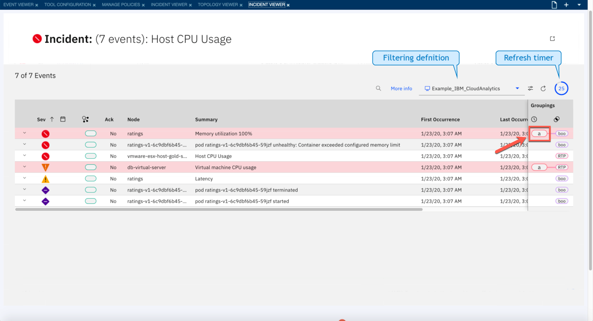

### 2. Here the operator is presented with more details and insight into the reason behind the automatic grouping of the events. Based on previous occurrences, these events tend to occur at the same time, in fact this happened for the first time on July 11 and has happened 11 times since then. You can see a heatmap showing the previous instances of this correlation. You can also see that this grouping was already reviewed and approved by one of your teammates. Click _the twiste icon_ to read the comments left for this grouping.

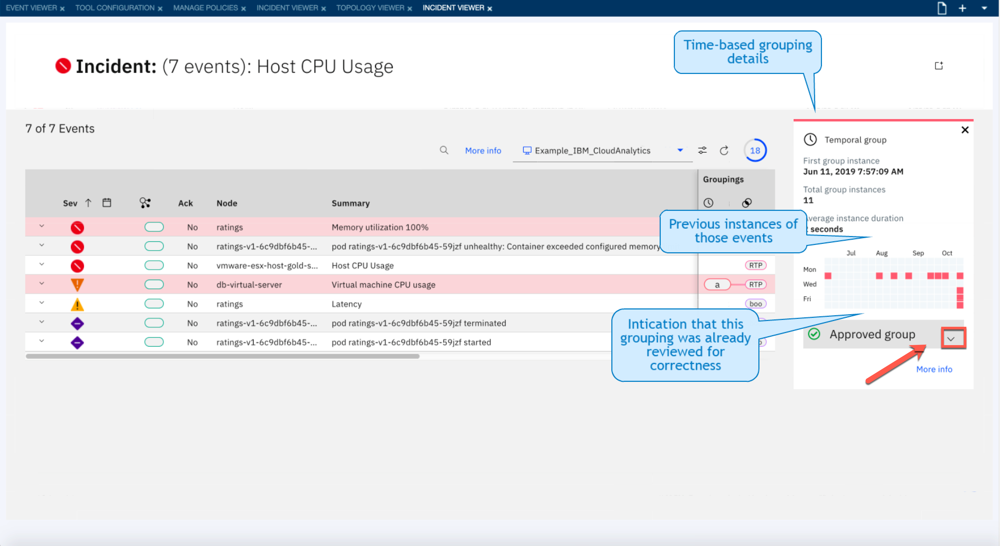

### 3. Operators can leave comments on the groups which can be seen the next time the analytics group the same set of alarms. This sharing of knowledge between operations staff help to greatly reduce MTTR. Click ‘More info’ to find out more about these events.

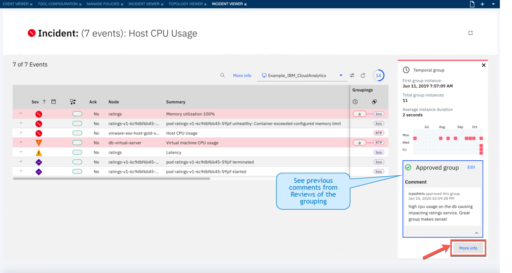

### 4. By using a timeline, you can select a specific period for analysis. When marked, the view shows the actual timing of the events and you can see that they always occur together within 2-second intervals. Let’s get back to the incident view to see details of other groupings. Click the 'Incident' link in the top-left corner

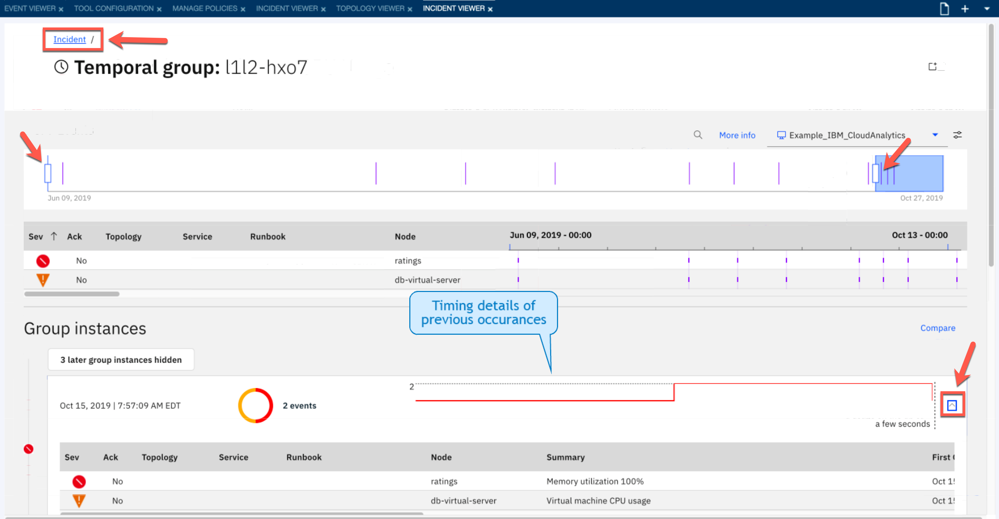

### 5. The second grouping type denominates the events that were correlated as they share some common attributes – in our case, these events are all related to service called "Bookinfo". Click the _‘boo’_ icon in the top row to see details.

### 6. The scope grouping widget allows a detailed analysis of the shared attributes. Close the widget with the X mark in the top-right corner

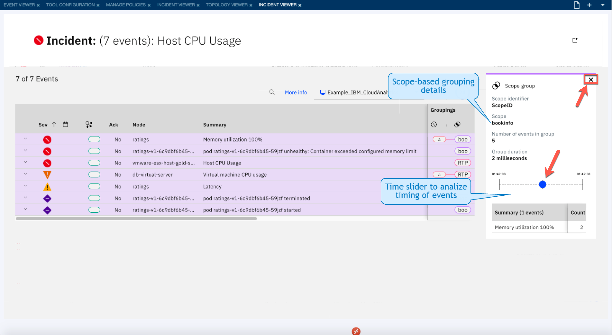

### 7. The topology column marks the events that are related to the objects found in the topology. Let’s explore it by clicking the icon in the Topology column.

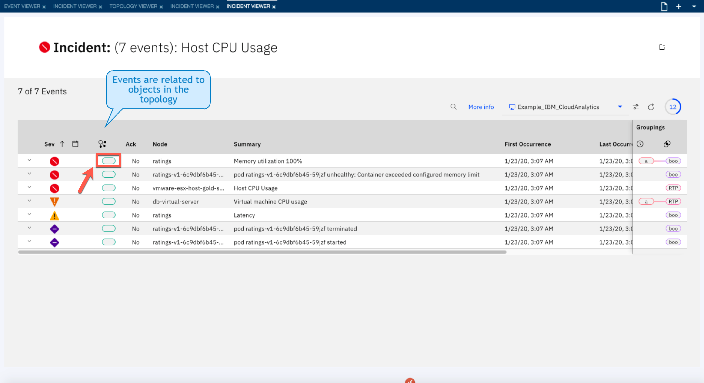

### 8. The topology widget shows the objects that are directly affected by events and their relationships. You can see that the ratings container with the memory issue, is a member of the "ratings" pod. Click the "ratings-v1-6c9dbf6b45-59jzf" icon to see which events affect the pod. 

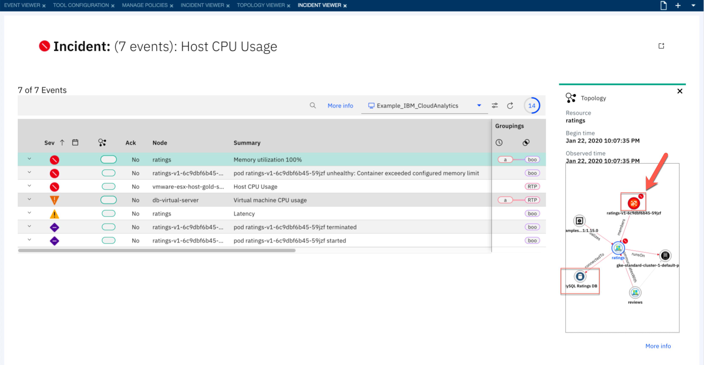

### 9. Using topology we have confirmed the ratings container memory issue is affecting the pod events. We noticed the MySQL RatingsDB is connected to the ratings container. Click the db-virtual-server node topology icon to explore the topology of the db-virtual server. 

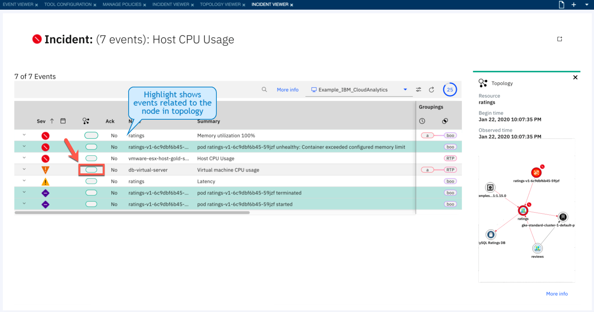

### 10. We now confirm the MySQL Ratings DB runs on the db-virtual server which is hosted on the virtual host vmware-esx-host-gold-svc. Both the virtual server and the host are experiencing high CPU usage which is impacting the performance of our ratings service. We can also explore the topology in more details by clicking 'More info' and see how this group of alarms is affecting the full topology to confirm our findings. 

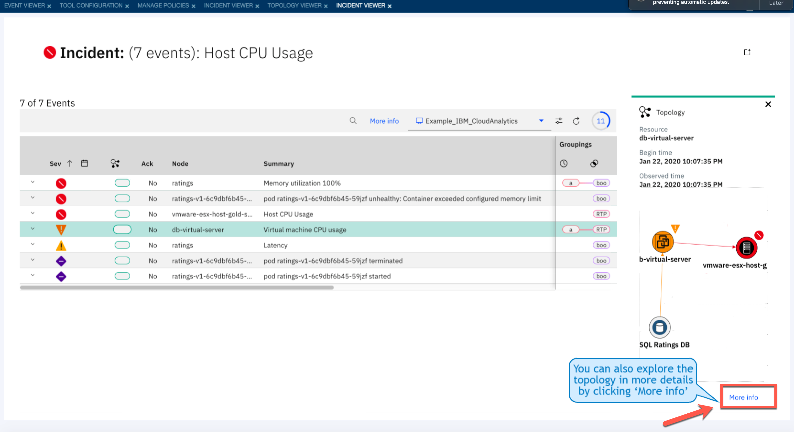

### 11. Full topology viewer allows for exploring all the topology information also in historical context. The timeline slider in the bottom shows any changes that were detected by the system – but in our case, it does not provide more insights. Now expand the topology to see 3 hops from our db-virtual-server to confirm our findings. 

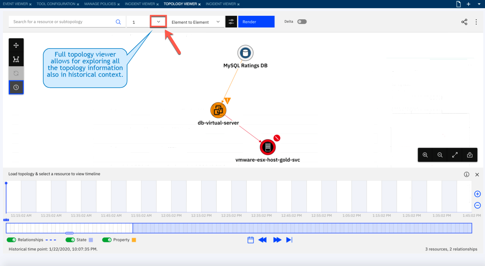

### 12. Looking at the full topology operations can see the incident alarms in context to the full toplogy helping them confirm the root cause of the incident. Now let's return to the event viewer and see how Netcool Operations Insights automation capabilities can help operations resolve the problem.

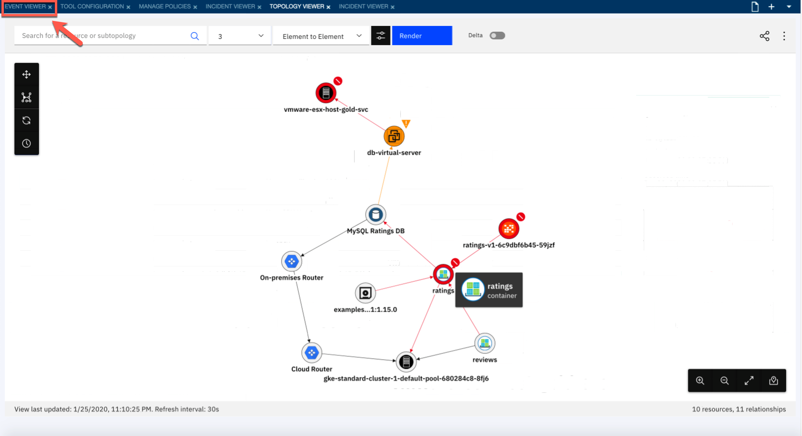

[Continue to Exercise 3](../Exercise3/README.md)
