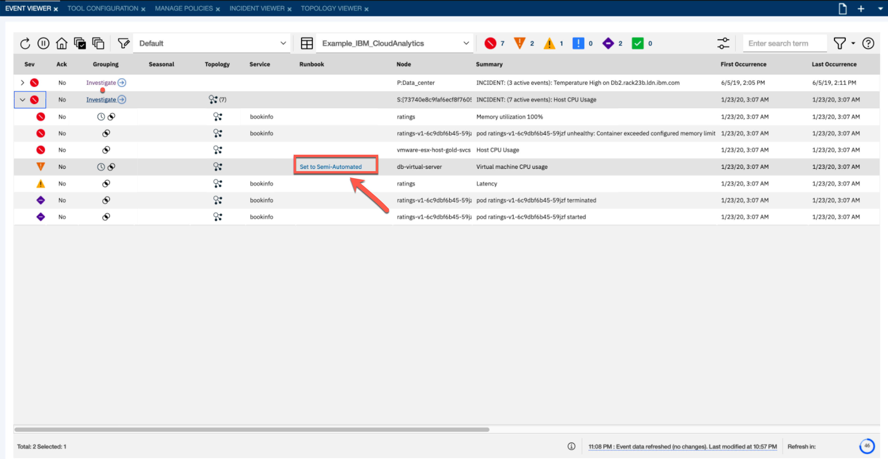
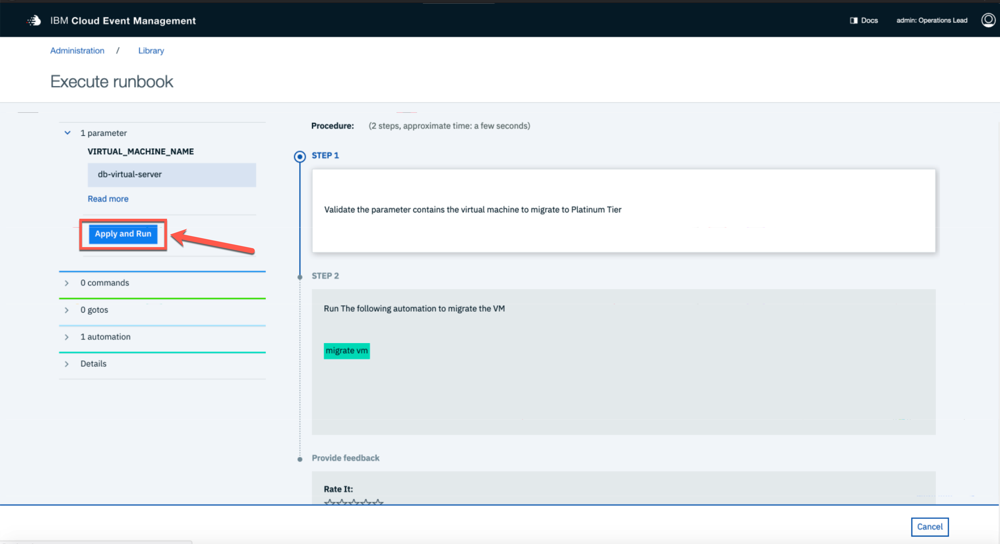
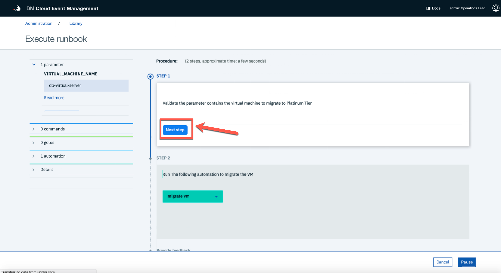
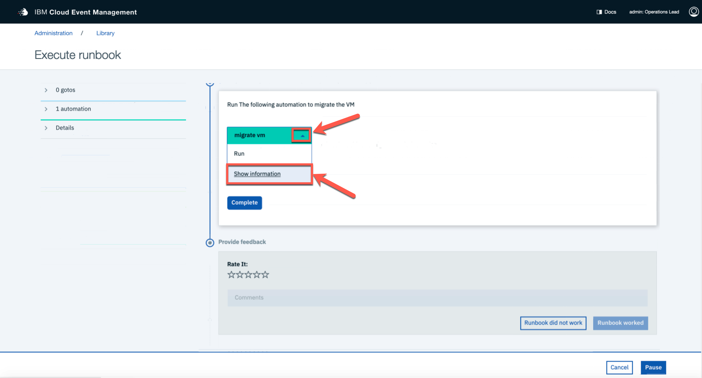
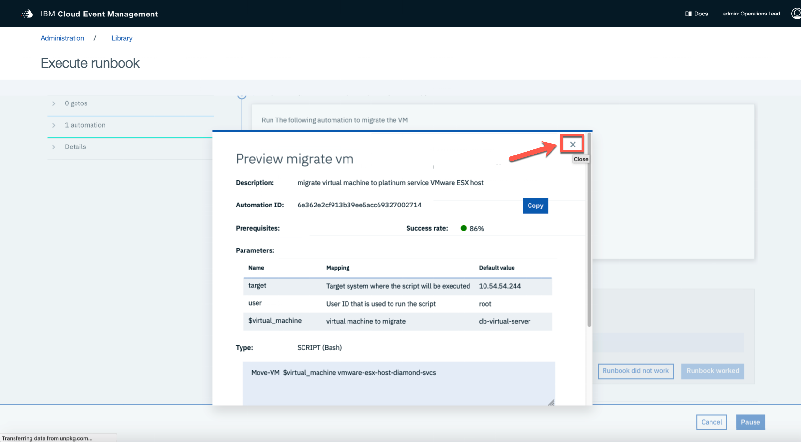
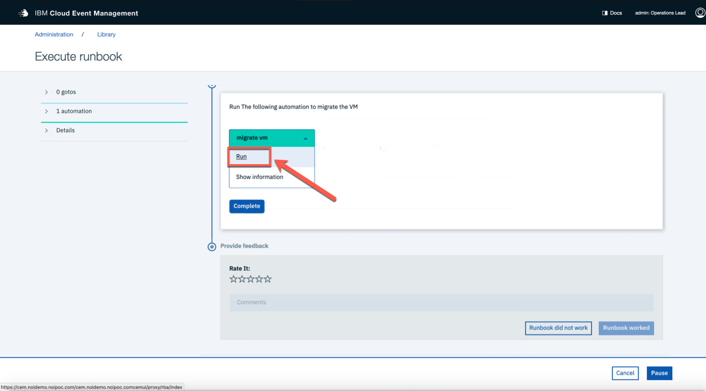
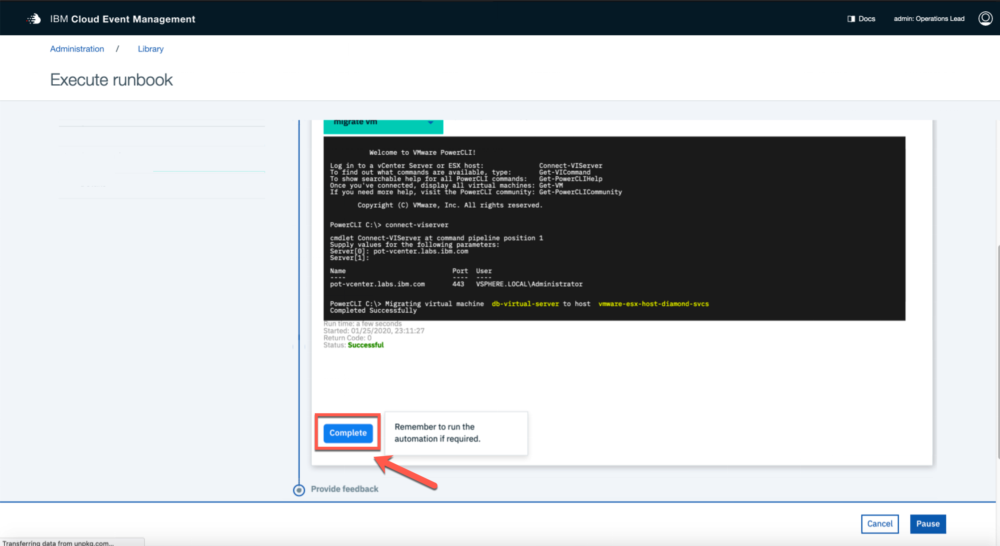
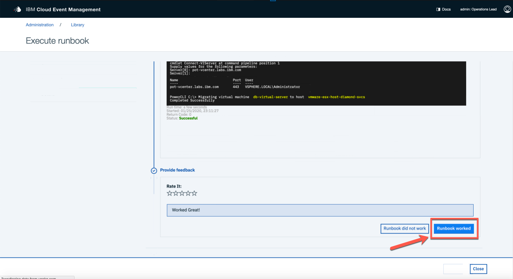

## In this section, you summarize the findings from the investigation phase to find the probable root cause. In order to resolve the issue, you apply the recommended runbook automation.

[Go back to the Table of Content](../README.md)

## Summary of Findings:

###  From the time-based grouping, you have learned that "Virtual Machine CPU Usage" on the db-virtual-server node and "Memory utilization 100%" events on the pod container are likely related. Based on the topology analysis, it seems that the cpu usage issues that are experienced by the db-virtual-server and it's esx-host are causing the container within the pod to cache the requests, which deplete the available memory.

### This, in turn, causes an out-of-memory condition, which makes Kubernetes kill the pod. As a result, service is disabled and users experience high latency. 

### 1. Let's try to resolve the incident. Netcool Operations Insights runbook automation has the ability to let your subject matter experts associate events with runbooks. It seems our vmware subject matter experts have suggested a runbook for our db-virtual-server CPU usage issue. Click the runbook column and next select Open runbook.

### 2. You can see that this procedure has 2 steps and one input parameter which was automatically populated based on event attributes. The procedure is meant to check details of the node that is experiencing cpu usage issues and then call the runbook automation that migrates the virtual machine to another esx host. Click the Apply and Run button to apply parameter value to the runbook steps.

### 3. Step 1 is to simply verify we have the correct host. Click Next Step to proceed to the automation to migrate the virtual machine.

### 4. Click "migrate vm" and choose "Show Information" to see a description of the automation.

### 5. Close the "Show Information" window.

### 6. Now select "Run" to execute the runbook automation.

### 7. Finally, click Complete. From the output of the runbook automation, you can see that the node was successfully migrated. 

### 8. Now you can mark the runbook as working and provide the optional feedback for the next users. This completed the scenario. 

