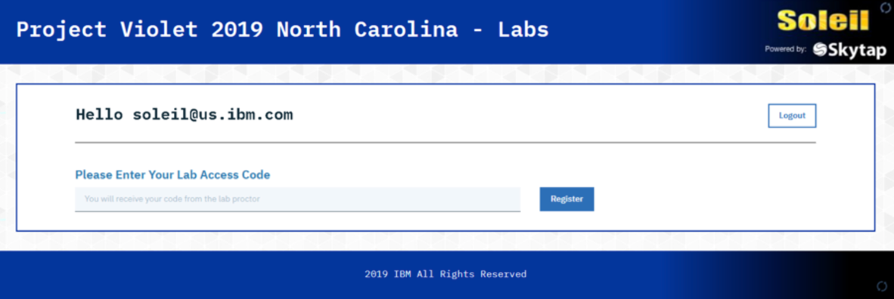
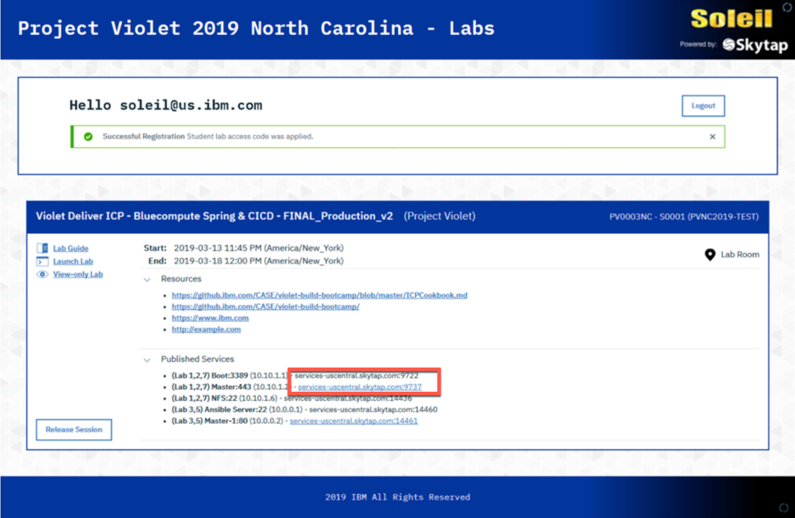

# Accessing the lab environment

Version 1.0     Author: Wlodek Dymaczewski, IBM

For the FastStart 2020 labs related to the IBM Cloud Pak for Multicloud Management - IBM Cloud App Management component you will be using the central Hub server installed in IBM Cloud and the managed cluster that will run in Skytap.

To access the Hub cluster open a browser on your workstation and point it to:

https://icp-console.apps.169.61.23.248.nip.io

To access the managed cluster you need a terminal with SSH client. On Mac or Linux workstation use a regular terminal, on Windows use Putty

## Connecting to the managed cluster

When you login to the event URL using the form similar to the following screenshot



you will see the page that looks like this



Take a note of the port next to the **managed-cluster** VM

Connect to the VM using user **localuser** with password **passw0rd**

For Mac and Linux
```
ssh -p <port> localuser@services-uscentral.skytap.com
```

For Windows use putty


## Coping files between your local workstation and managed-cluster

If you need to copy any file between your local workstation and managed-cluster in Skytap, use the following:

For Mac and  Linux
```
scp -P <port> <source-file> localuser@services-uscentral.skytap.com:<target-path>
```

For Windows use WinSCP or equivalent tool


