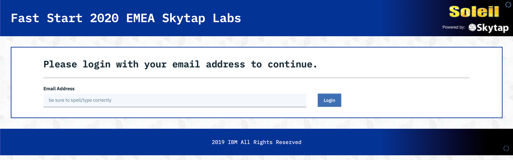
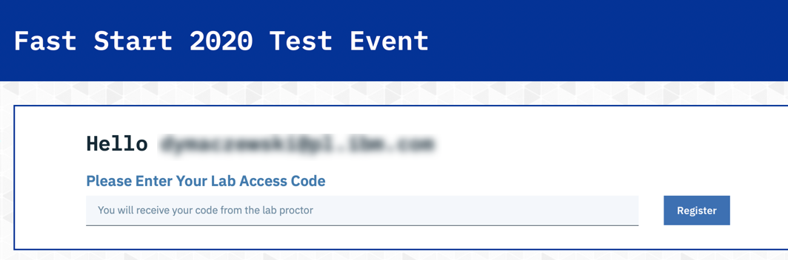
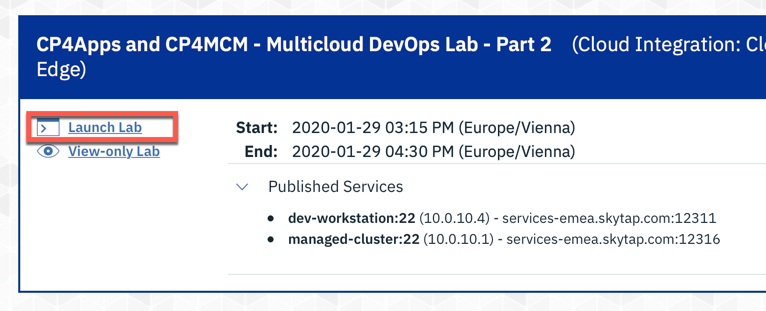
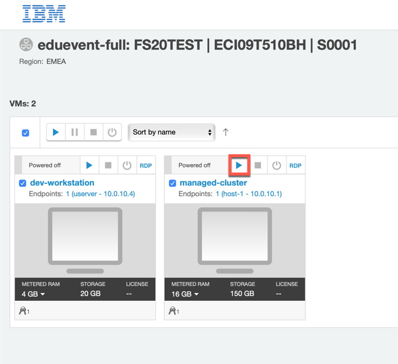
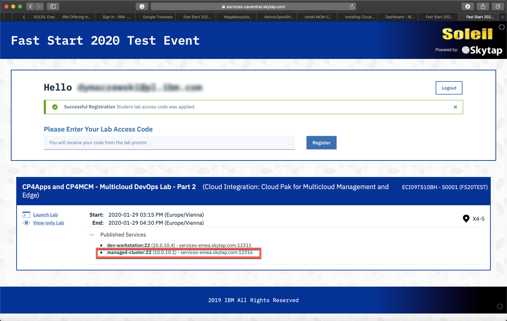
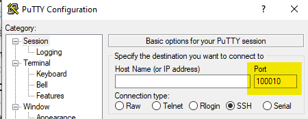

# Accessing the lab environment

[Go back to the Table of Contents](../../README.md)

For the FastStart 2020 labs related to the IBM Cloud Pak for Multicloud Management - IBM Cloud App Management component you will be using the central Hub server installed in IBM Cloud. This environment is setup to be multi-tenant where each student has their own isolated tenant.  Each student will have their own ICP cluster in Skytap that you will manage from the centralized Hub server.

<table border="1">
<tr><th colspan="3">Access credentials</th></tr>
<tr><th>Interface</th><th>Username</th><th>Password</th></tr>
<tr><td>IBM CloudPak for MCM User Interface</td><td>assigned to you by lab instructor (<b>userXX</b>)</td><td><b>alpine-has-acorn-valley</b></td></tr>
<tr><td>managed-cluster VM</td><td><b>localuser</b></td><td><b>passw0rd</b></td></tr>
</table>

## Connecting to the IBM CloudPak for Multicloud Management Hub

To access the Hub cluster open a browser on your workstation and point it to:

<a href="https://icp-console.apps.169.61.23.248.nip.io" target="_blank">https://icp-console.apps.169.61.23.248.nip.io</a>

**ATTENTION: Lab tutorials were tested with Firefox browser.**

## Connecting to the managed cluster

To access the managed cluster you need a terminal with SSH client. On Mac or Linux workstation use a regular terminal, on Windows use Putty

Open the [https://ibm.biz/fs20skytap](https://ibm.biz/fs20skytap) link given you by instructor. You should see the form similar to the one shown below:



Provide you email address and click **Login**. Then, provide the code given you by instructor and click **Register**



Verify that the environment was started. Click **Launch Lab** link on the left.



If the managed cluster VM is not running start it clicking **Play** button. You can ignore the dev-workstation VM - it won't be used in this lab



<span style="color:red">**IT IS NOT RECOMMENDED TO USE SKYTAP UI TO CONNECT TO THE MACHINE - YOU WILL USE A TERMINAL CONNECTION DIRECTLY FROM YOUR WORKSTATION**</span>

You should see the page that looks like this



Take a note of address and the port number, next to the **managed-cluster** VM. In above example, it is *services-uscentral.skytap.com* and *12316*. It is the SSH port exposed from the virtal machine for your instance.

Open the terminal on your workstation. Connect to the VM using user **localuser** with password **passw0rd**

For Mac and Linux
```
ssh -p <port> localuser@<address>
```

for example:
```
ssh -p 12316 localuser@services-uscentral.skytap.com
```

For Windows use putty



## Copying files between your local workstation and managed-cluster

When you need to copy any file between your local workstation and managed-cluster in Skytap, use the following:

For Mac and  Linux
```
scp -P <port> <source-file> localuser@services-uscentral.skytap.com:<target-path>
```

For Windows use WinSCP or equivalent tool


[Go back to the Table of Contents](../../README.md)

<table>
  <tr>
    <td>Version</td>
    <td>1.0</td>
  </tr>
  <tr>
    <td>Author</td>
    <td>Wlodek Dymaczewski, IBM</td>
  </tr>
  <tr>
    <td>email</td>
    <td>dymaczewski@pl.ibm.com</td>
  </tr>
</table>


