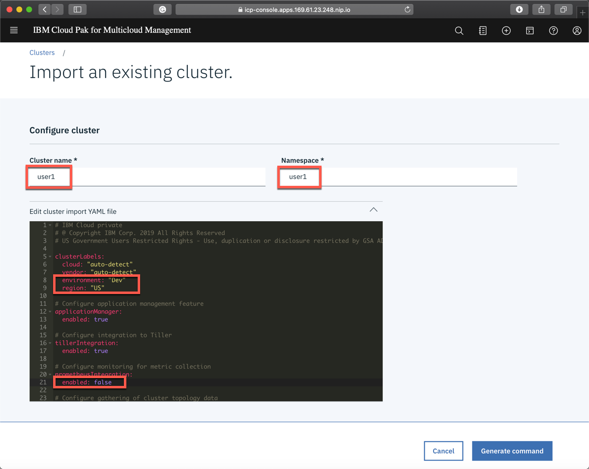
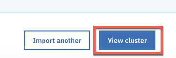

# Exercise 1 Adding a managed cluster

[Go back to the Table of Contents](../../README.md)

During this lab, MCM klusterlet is deployed to a managed cluster on a multi-tenant environment.

## Login to IBM CloudPak for Multicloud Management console

### 1. On you workstation open a browser and point it to <a href="https://icp-console.apps.169.61.23.248.nip.io" target="_blank">https://icp-console.apps.169.61.23.248.nip.io</a>

### 2. Login with the credentials given you by the instructors


### 3. Open **Menu** > **Automate infrastructure** > **Clusters**


### 4. Click **Add cluster**


### 5. Pick the **Import** option and click **Select**


### 6. Specify your userid when prompted for the cluster name (namspace will auto-populate with the same value).  By naming the cluster with your userid, we'll ensure that there are no duplicate cluster names. 

Edit the **Cluster import YAML file** to: 
 - uncomment ```environment``` and ```region``` clusterLabels 
 - disable prometheusIntegration

DO NOT change the envrionment label to Production at this point! You will first deploy configpak secret in the later exercise.



   Then click **Generate command**

If you see the following error


it means that your cluster name does not match your userid

*Explanation: For each tenant we have precreated the namespaces matching the userid and assigned them to relevant teams/tenants as managed resource. Since working as userX you don't have cluster admin role you do not have access rights to create a new namespace*


### 7. Click the copy icon next to the generated command


### 8. Paste the command in the terminal window where you connected to the managed-cluster environment

You don't need to authenticate to the managed cluster. It is a minimal (edge-profile) ICP installation without IAM services deployed so cloudctl command won't work against that cluster.


If you see the following error
```
error: unable to recognize "STDIN": no matches for kind "Endpoint" in version "multicloud.ibm.com/v1beta1"
```
just apply the command again.

*EXPLANATION: First resource being created registers new API Endpoint "multicloud.ibm.com/v1beta1". Last resource uses this API. In case the last resource is processes before the first one is completed (Kubernetes Controllers work asynchronously) this may happen.* 

### 9. Observe the multicluster-endpoint being deployed running the following command
```
kubectl get pods -n multicluster-endpoint
```
After about 2 minutes the output should look like:
```
localuser@edge-server:~$ kubectl get pods -n multicluster-endpoint
NAME                                                  READY   STATUS              RESTARTS   AGE
endpoint-appmgr-69dcf8d57c-9hcn9                      1/1     Running             0          2m42s
endpoint-component-operator-5f8c655b95-zvzdn          1/1     Running             1          3d19h
endpoint-connmgr-758f596c74-nfws6                     1/1     Running             0          2m42s
endpoint-policyctrl-5747949b95-xxzxs                  2/2     Running             0          2m42s
endpoint-search-5bd5b5885f-2phw2                      1/1     Running             0          2m42s
endpoint-svcreg-844c49fb6d-dpxrn                      1/1     Running             0          2m41s
endpoint-svcreg-coredns-667ff545d4-ct7r5              1/1     Running             1          3d19h
endpoint-topology-weave-collector-7c4d4fd6fd-x4mkz    1/1     Running             0          2m41s
endpoint-topology-weave-scope-4k9s2                   1/1     Running             1          3d19h
endpoint-topology-weave-scope-app-7954c74ddc-5mfln    2/2     Running             2          3d19h
endpoint-workmgr-54987c7fdb-9dxxn                     1/1     Running             0          2m42s
ibm-multicluster-endpoint-operator-854f9b7cbb-jscjk   1/1     Running             1          3d19h
```

### 10.  Go back to the browser window. Click **View Cluster** to open a cluster details. 



### 11.  If registration was successful you should see the similar view
    


This concludes the exercise. You now have a kubernetes cluster that can be managed by MCM and monitored by ICAM.

[Go back to the Table of Contents](../../README.md)

<table>
  <tr>
    <td>Version</td>
    <td>1.0</td>
  </tr>
  <tr>
    <td>Author</td>
    <td>Wlodek Dymaczewski, IBM</td>
  </tr>
  <tr>
    <td>email</td>
    <td>dymaczewski@pl.ibm.com</td>
  </tr>
</table>