# Exercise 10 Creating a Runbook

[Go back to the Table of Content](../../README.md)

Runbooks help you to simplify and automate repetitive tasks. This helps overcome organizational complexity, varying skill sets, confusing alert noise and reliance on too much manual effort, all of which contribute to delays, disruption and risk of error. 

You can create your own custom runbooks and manage your existing catalog of runbooks in ICAM. You have different levels of access to runbooks depending on your role in ICAM. The Operations lead role provides full access to runbook management, including the permission to approve runbooks for publishing. The Operations engineer role provides access to runbook management without the publishing approval permission. Users who have the Operator role can only preview and run runbooks assigned to them. 

ICAM supports three different types of runbooks:

### Manual runbooks
  Steps describe the exact procedure that an operator must follow. The operator uses standard tools, which can be accessed from their working environment.

### Semi-automated runbooks
  Each step describes exactly what an operator must do. Additionally, the operator can run an automated task on a target system.

### Fully automated runbooks
  The runbook runs automatically without operator interaction.

To create a new Runbook go to the Administration page:

Once there, click on the Runbooks tile:

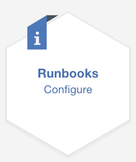

On the Runbooks page you will be on the Library tab and you will see several example runbooks that come with ICAM out of the box. You are free to enable, customize and use these in your own environment if you so choose.  The other tabs available are Execution, Automation, Triggers and Connections.  We will not be working with these functions, but they are defined below.

### Execution
  This is where you can find all runbooks that have been started, including runbooks that are in progress.

### Automations
  In runbooks, an automation is the collection of several manual actions into a single automated entity. Automations use the parameters of the runbook and you can customize the parameters for the execution of the runbook which will lower the time needed for the execution. Automations eliminate the risk of manual errors that you get repeating the same steps many times.

### Triggers
  If you have events that always correspond to the same runbook you can create a trigger and link the event with the runbook. Triggers can run with manual and automated runbooks. If the runbook is a manual or semi-automated runbook, the operator must complete the parameter values. If the runbook is fully automated, the trigger runs with pre-defined values. The operator does not even notice that the runbook was executed.

  You must install Netcool/Impact to run the trigger service.

### Connections
  Runbooks can connect to your target endpoints, for example your on-premise back-end system. To trigger runbook executions from incoming events, set up a trigger connection. The connections currently available are Ansible Tower, BigFix, Omnibus/Impact, and a script.

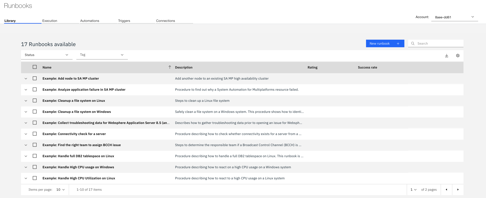

Hover your mouse over the “Cleanup a file system on Linux” example runbook, then click on the eyeball in the menu that is shown on the right to view the configuration.

When you are done reviewing the configuration, we are going to create a runbook that will scale up a MySQL deployment to help resolve an application performance issue.  Click “Close” in the bottom right corner then click “New runbook” in the upper right corner.

In the New runbook page complete the following steps:

Give your runbook a name.  You can name it anything you want.
Enter a description.

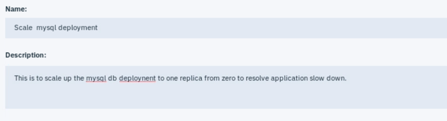

Next create “Parameters” for the username and password for the oc login command.  Click on the + sign next to Parameters on the menu on the right.

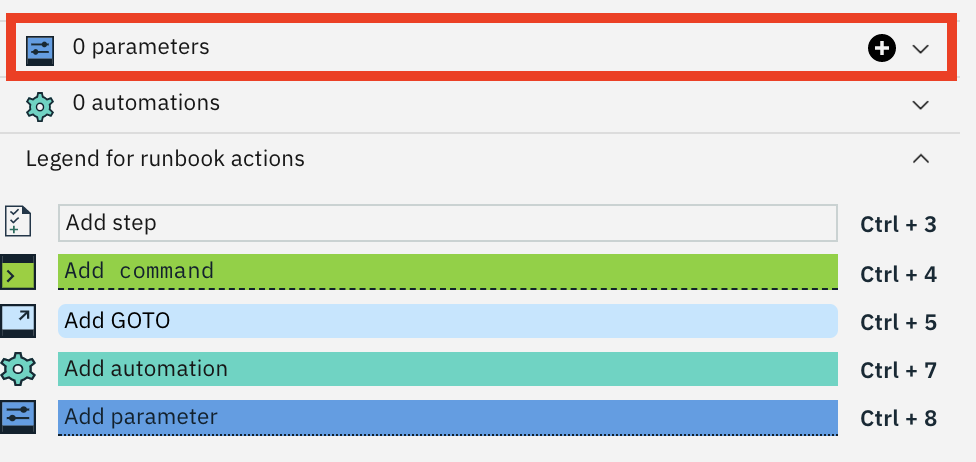

In the “New parameter” window that opens, enter your username information as shown below:

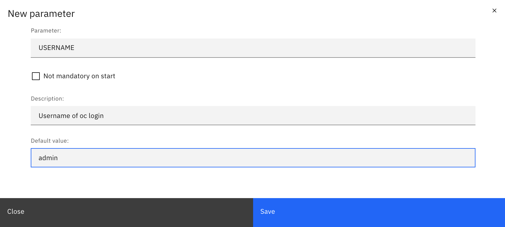

Then do the same for password, clicking the + and entering Passw0rd! for the value.

Now click inside the Procedure window and start inserting Step separators by typing Ctrl+3.  There are four basic steps to this process so enter 4 step separators.

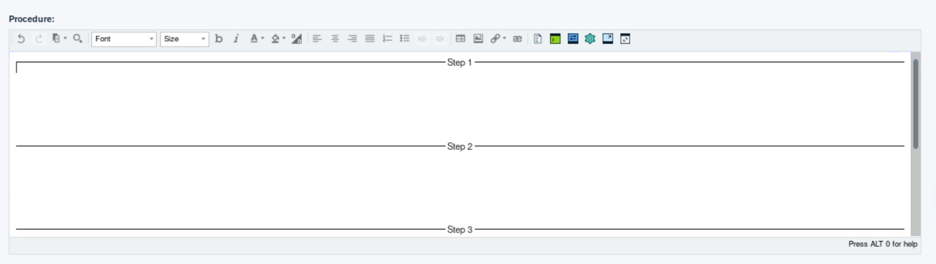

Next add a description to Step 1 and then click “Add command” and enter su -i

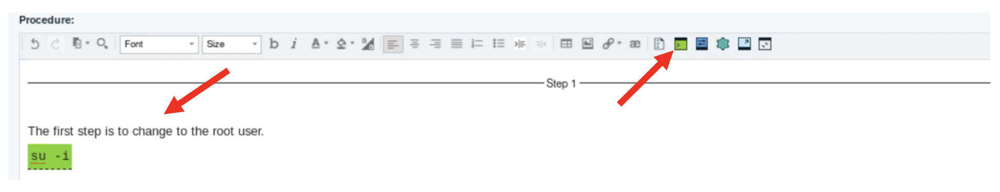

For Step 2 we will log in to Openshift.  After adding a description you will need to add another “Add command” action.  Enter this command:

Type:  oc login -u username -p password

Where username and password are the parameters you defined.  To add the username and password parameters, drag them from the menu on the right, using the 6 dots next to the name, and drop them onto the command line. 

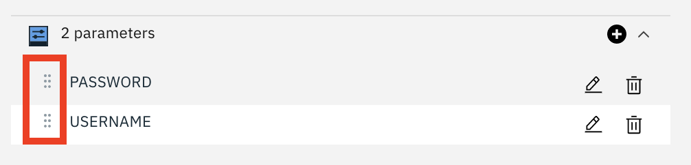

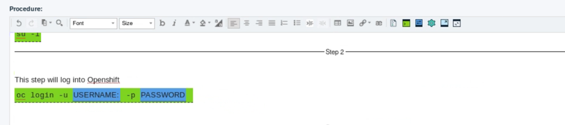

Step 3 will ensure that you are in the correct project/namespace to execute the upscale procedure. Enter a description then add another “Add command” action.  Enter this command:

Type:  oc project bookinfo-app

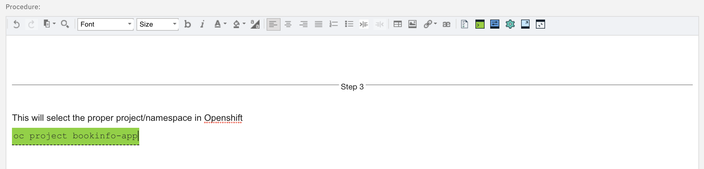

The final step will scale the mysql database up from zero replicas to one.  Enter a description then add another “Add command” action.  Enter this command:

Type: kubectl scale deployment --replicas=1 mysqldb-v1

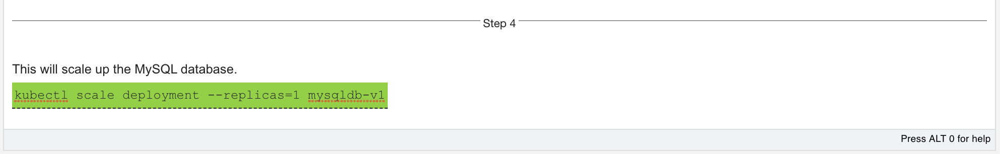

This completes the steps needed for creating this runbook.  You can click “Save draft” from the menu in the bottom right corner to save this, then click “Publish”.

 In the Library tab of the Runbooks page find your runbook that you just created and give it a test run by clicking the “Run the steps of the runbook” icon shown here:

In the Execute runbook window you will see all of you steps listed on the right side.  Click the “Apply and Run” button, and you will notice that the USERNAME and PASSWORD parameters have been entered into the oc login command in Step 2.

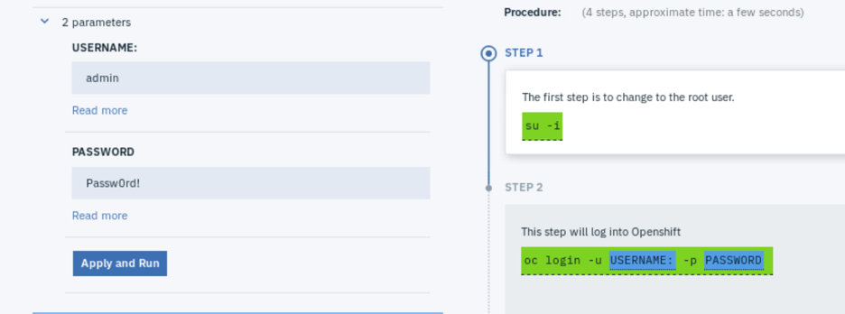

Step 1 is now ready, instructing you to copy the command to be pasted into a command line.  You don’t need to actually perform these steps so you can just click “Next step” as shown below.

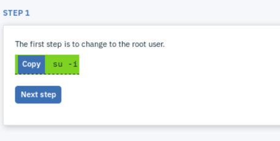

Continue this same process through all four steps until you get to the “Provide feedback” section.  Here you can give the runbook a star rating and enter any comments you may have regarding its performance.  This lets other operators and SREs know how successful this runbook is and whether they can depend on the results.  After several successful and highly rated runs, this would be a good indicator that the runbook may be a candidate for automating.

Give the runbook your rating and then click “Runbook worked”.

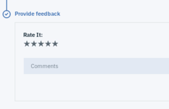

This concludes the exercise.

[Go back to the Table of Content](../../README.md)

<table>
  <tr>
    <td>Version</td>
    <td>1.0</td>
  </tr>
  <tr>
    <td>Author</td>
    <td>Sean Lombardo, IBM</td>
  </tr>
  <tr>
    <td>email</td>
    <td>sean.lombardo.ibm.com</td>
  </tr>
</table>

