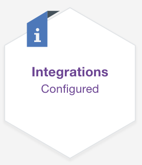
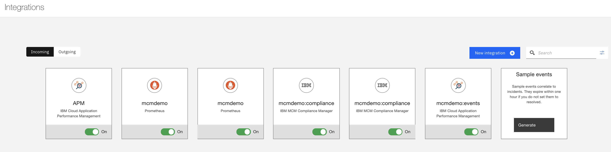
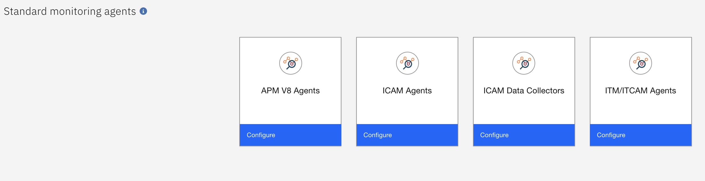
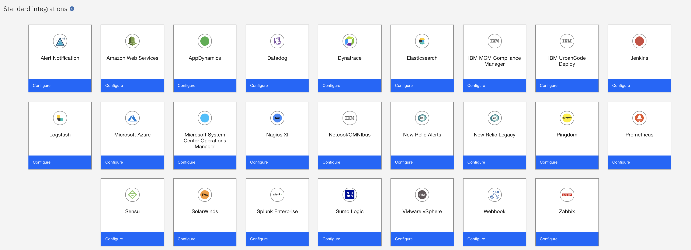

# Exploring Integrations

[Go back to the Table of Contents](../../README.md)

You can integrate other products with Cloud App Management to provide you with a robust monitoring solution.  Listed below are the types of integrations offered.

### Configuring monitoring data sources
Integrate your IBM® Tivoli® Monitoring and IBM Cloud Application Performance Management supported agents to receive their events and view their resources in the Cloud App Management console. You must define one or more data sources before you configure any other capabilities or see metrics in the Resources dashboard page.

### Configuring incoming event sources
The standard integrations are incoming event sources from outside ICAM.

### Configuring outgoing event destinations
Integrate with the tools and systems to which you want to send events and data from ICAM. For example, you can integrate with IBM Tivoli® Netcool/OMNIbus to forward events to the event manager or integrate with Slack to forward events and metrics to members of your team or SMEs.

To access the Integrations go to the Administration page:

Once there, click on the Integrations tile:

On the Integrations page, you will see two tabs for integrations “Incoming” and “Outgoing”. Clicking on the two buttons enables you navigate between the incoming and outgoing integrations. By default you are on the Incoming tab so let's explore that first.  

In your environment the are likely some incoming integrations already configured, along with the standard Sample events integration which allows you to generate events for testing purposes.

To see what incoming integrations are available click on the New integration button in the upper right of the screen.

In the next screen you will see it is divided into two sections, "Standard monitoring agents", and "Standard integration".

The standard monitoring agents integrations are all for monitoring agents from the various IBM legacy monitoring applications, as well as for the latest ICAM agents and data collectors.

The standard integration section provides out of the box integrations for most of the major applications in the industry today.  This will allow for an easy to configure integration so you can start receiving events quickly.

If there is a product not listed here, then you can use the Webhook integration to create a custom integration.

Feel free to click Configure on any of the integrations to see how you would configure them.  When you are done, click cancel at the bottom of the configuration window, and then again at the bottom of the integrations window.

You should be back at the main integrations page now.  Click on the Outgoing tab to be taken to that page.  Most likely there will be no outgoing integrations configured yet so you will just have a blank page.  Click on the New integration button to see what is available.

Notice that this page has only one section - Standard integrations.  These are some of the more common applications that you would likely integrate with to send your events.  Like on the incoming integrations page, there is a Webhook integration here as well to enable custom integrations for any applicaitons not provided out of the box.

Feel free to click Configure on any of the integrations to see how you would configure them.  When you are done, click cancel at the bottom of the configuration window, and then again at the bottom of the integrations window.

This concludes the exercise.

[Go back to the Table of Contents](../../README.md)

<table>
  <tr>
    <td>Version</td>
    <td>1.0</td>
  </tr>
  <tr>
    <td>Author</td>
    <td>Sean Lombardo, IBM</td>
  </tr>
  <tr>
    <td>email</td>
    <td>sean.lombardo@ibm.com</td>
  </tr>
</table>