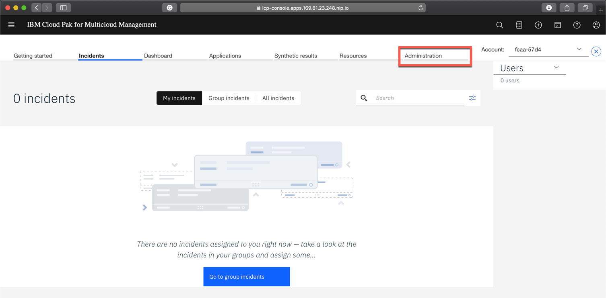
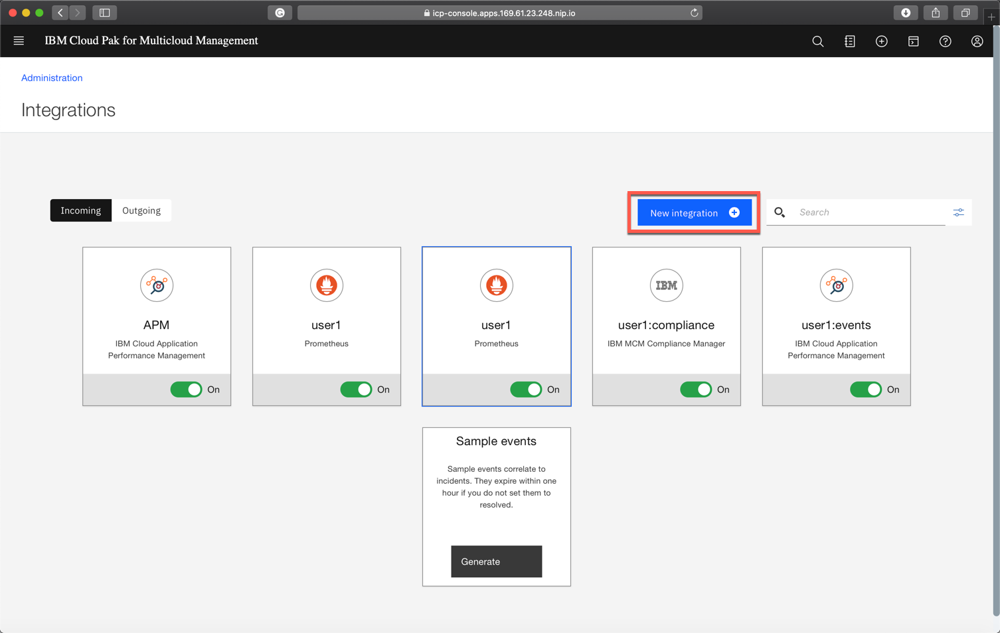

# Exercise 2 Install k8s monitor to the managed cluster

[Go back to the Table of Content](../../README.md)

## Gather config-pak for your tenant

### 1. In the browser window where you are logged in to IBM Cloud Pak for Multicloud Management open top-left menu and select **Monitor health** and **Incidents**


### 2. When the IBM Cloud App Management Incident view opens, click the **Administration** tab



### 3. Click the **Integration** tile


### 4. In the Integrations view click **New integration**



### 5. Click **Configure** under the **ICAM Data Collectors** tile


### 6. Do not provide any name, just click the **Download file** button and save the file to your workstation


### 7. Copy the config file to the managed cluster (Remember to change the port number to one matching your environment instance)
```
scp -P <port> ibm-cloud-apm-dc-configpack.tar  localuser@services-uscentral.skytap.com:/home/localuser/install/app_mgmt_k8sdc
```

### 8. In the terminal window where you are logged in to managed cluster run the following commands, adjusting the **cluster_name** value
   
**ATTENTION: Remember to change the cluster_name in the command!**   
<pre>
cd install/app_mgmt_k8sdc
ansible-playbook helm-main.yaml --extra-vars="<b>cluster_name=user1</b> release_name=icam-kubernetes-resources \
docker_registry=edge-server.demo:8500 namespace=default docker_group=default tls_enabled=true"
</pre>

Ansible playbook should finish with the following line
```
PLAY RECAP ****************************************************************************************************************************
127.0.0.1                  : ok=15   changed=8    unreachable=0    failed=0    skipped=2    rescued=0    ignored=0   
```

### 9. Verify that the K8Monitor is running
```
localuser@edge-server:~/install/app_mgmt_k8sdc$ kubectl get pod -n default
NAME                                                   READY   STATUS    RESTARTS   AGE
icam-kubernetes-resources-k8monitor-54876594c5-9xvzs   2/2     Running   0          48s
```
This concludes the exercise.

[Go back to the Table of Content](../../README.md)

<table>
  <tr>
    <td>Version</td>
    <td>1.0</td>
  </tr>
  <tr>
    <td>Author</td>
    <td>Wlodek Dymaczewski, IBM</td>
  </tr>
  <tr>
    <td>email</td>
    <td>dymaczewski@pl.ibm.com</td>
  </tr>
</table>