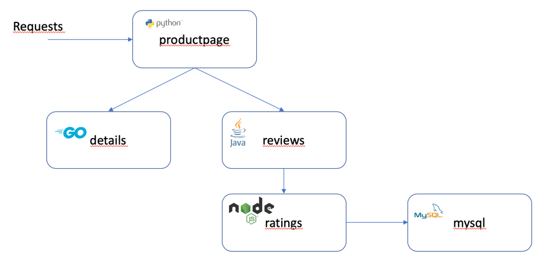
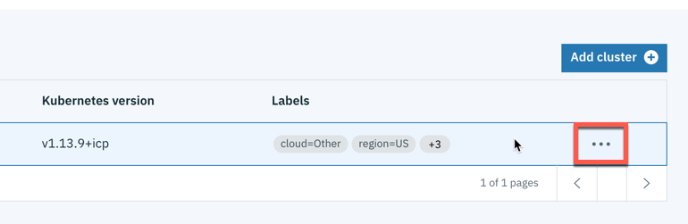

# Exercise 3 Installing the Bookinfo app into your managed cluster

[Go back to the Table of Contents](../../README.md)

In this exercise you will deploy sample application called Bookinfo. Bookinfo is built using cloud-native architecture and consists of 5 microservices, written in different languages and communicating over REST APIs. The diagram below illustrates the application architecture



## Preparing a namespace

### 1. In the terminal window connected to managed cluster run the following command

```
kubectl create namespace bookinfo
```
The Bookinfo app will be automatically deployed to the namespace that you just created by MCM, at the end of this exercise.

### 2. Create a secret with configuration required by data collectors to report data back to IBM Cloud App Management server

```
cd /home/localuser/install/app_mgmt_k8sdc/ibm-cloud-apm-dc-configpack
kubectl -n bookinfo create secret generic icam-server-secret \
--from-file=keyfiles/keyfile.jks \
--from-file=keyfiles/keyfile.p12 \
--from-file=keyfiles/keyfile.kdb \
--from-file=keyfiles/ca.pem \
--from-file=keyfiles/cert.pem \
--from-file=keyfiles/key.pem \
--from-file=global.environment
```
*Explanation: In the knowledge center, in section related to instrumenting different runtimes with data collectors, you may notice different number of files being used in the icam-server-secret. The syntax used above is taken from GO runtime*

### 3. Edit the **environment** label of the cluster in ICAM UI to value **Production**

Highlight the row with your cluster name (hover mouse cursor over) and click the '...' icon that shows on the right. Select **Edit labels**. 




Click the row "environment=Dev" to enter edit mode. Change the value from *Dev* to *Production*. Click **Save**


*EXPLANATION: You may wonder why not to assign the environment=Production label while registering the cluster. The reason is that we wanted you to first create the icam-server-secret in a target namespace, what you just did in the Step 2 above. If you reverse the order, after creating the secret you would have to restart the application pods so the data collectors pick it up*

This change makes your cluster match the placementrule for Bookinfo application subscription. The deployment is automatically triggered by subscription controller installed on Multicluster Management hub.

### 4. On the managed cluster observe the bookinfo app being deployed

```
kubectl get pods -n bookinfo
```

This conludes the exercise. Now you have a managed cluster that has Kubernetes data collector installed and instrumented Bookinfo application that is deployed to that cluster.

[Go back to the Table of Contents](../../README.md)

<table>
  <tr>
    <td>Version</td>
    <td>1.0</td>
  </tr>
  <tr>
    <td>Author</td>
    <td>Wlodek Dymaczewski, IBM</td>
  </tr>
  <tr>
    <td>email</td>
    <td>dymaczewski@pl.ibm.com</td>
  </tr>
</table>
