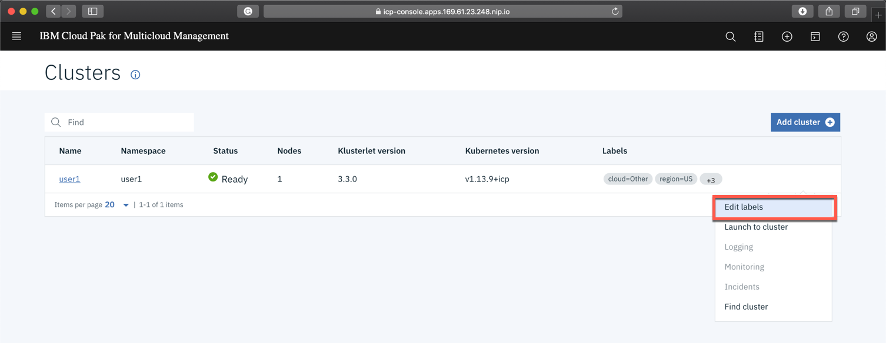
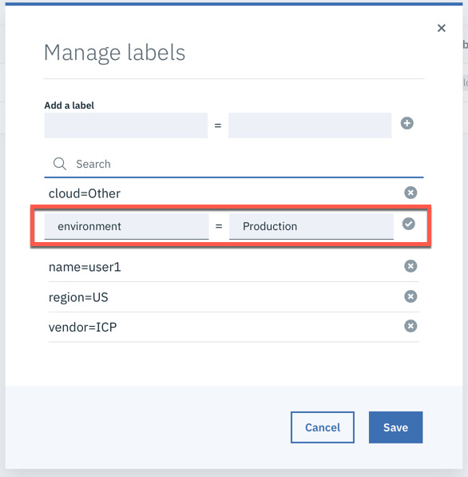

# Exercise 3 Installing Bookinfo app to a managed cluster

[Go back to the Table of Content](../../README.md)

## Preparing a namespace

### 1. In the terminal window connected to managed cluster run the following command

```
kubectl create namespace bookinfo
```
### 2. Create a secret with configuration required by data collectors to report data back to IBM Cloud App Management server

```
cd /home/localuser/install/app_mgmt_k8sdc/ibm-cloud-apm-dc-configpack
kubectl -n bookinfo create secret generic icam-server-secret \
--from-file=keyfiles/keyfile.jks \
--from-file=keyfiles/keyfile.p12 \
--from-file=keyfiles/keyfile.kdb \
--from-file=global.environment
```
### 3. Edit the **environment** label of the cluster in ICAM UI to value **Production**





### 4. On the managed cluster observe the bookinfo app being deployed

```
kubectl get pods -n bookinfo
```

This conludes the exercise.

[Go back to the Table of Content](../../README.md)

<table>
  <tr>
    <td>Version</td>
    <td>1.0</td>
  </tr>
  <tr>
    <td>Author</td>
    <td>Wlodek Dymaczewski, IBM</td>
  </tr>
  <tr>
    <td>email</td>
    <td>dymaczewski@pl.ibm.com</td>
  </tr>
</table>
