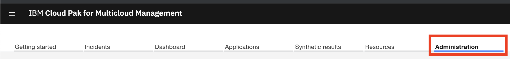
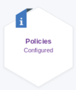
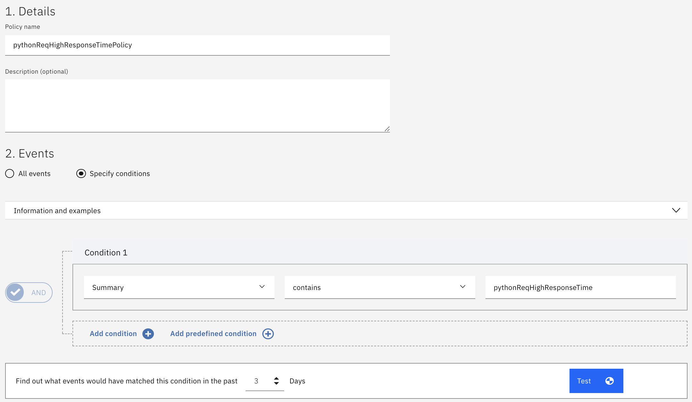
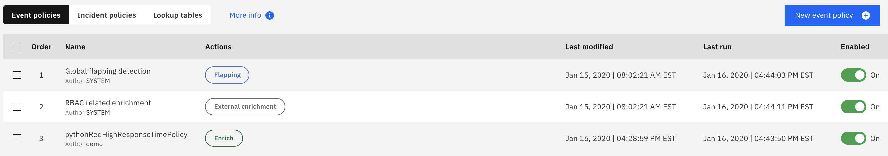
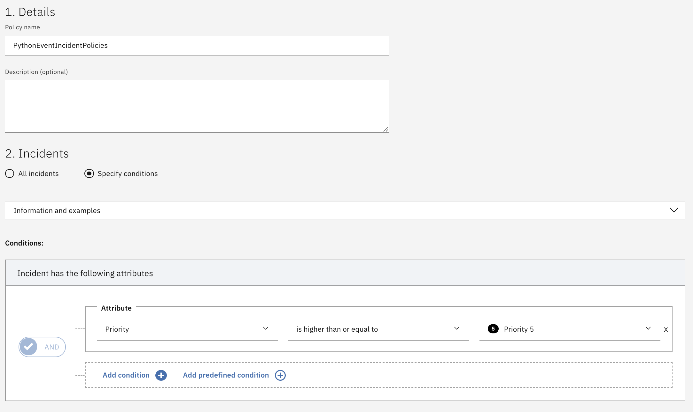
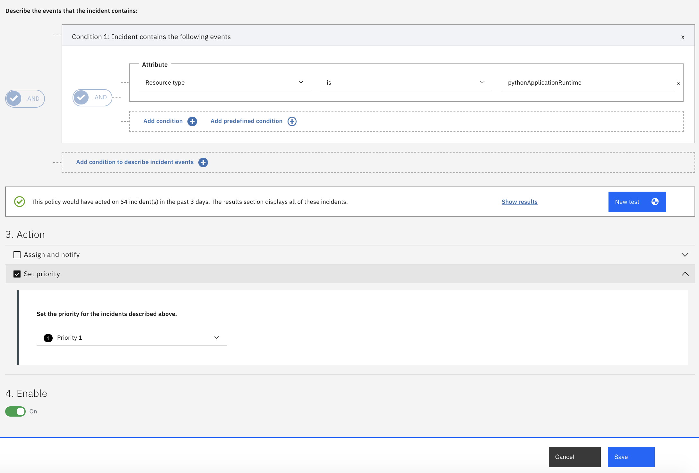
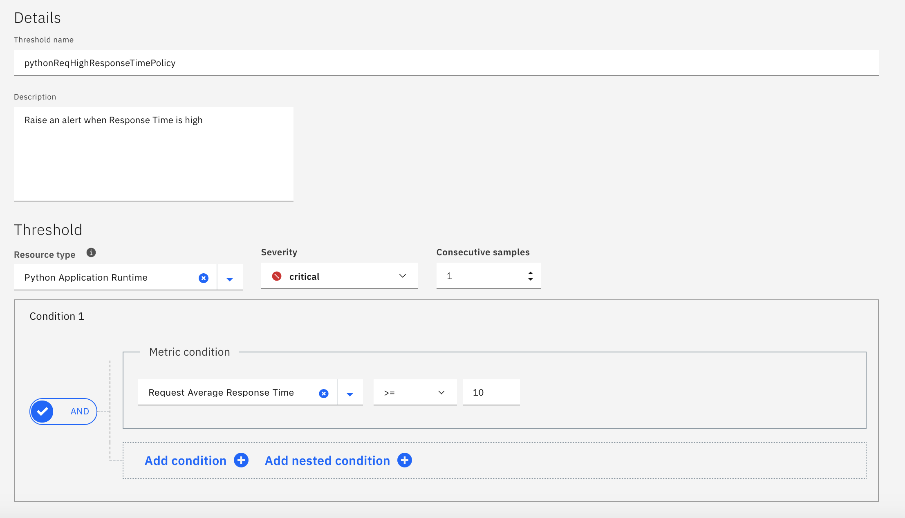
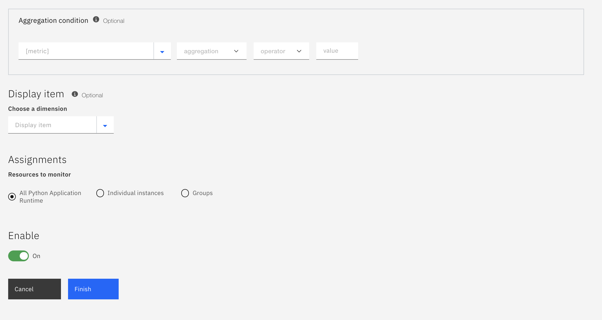

# Exercise 7 Creating a custom Event Policy, Incident Policy, and Threshold

[Go back to the Table of Content](../../README.md)

Before moving into this section, lets define some terms:

### Thresholds
Thresholds in IBM Cloud App Management, as the name would suggest, are a construct that checks to see if a metric has exceeded a specific level on an agent or data collector.  In IBM Tivoli Monitoring, we referred to these as situations.  Consider examples of file systems being full, applications being down, slow application response time, etc.

### Events
Thresholds can generate events when detected by an agent or data collector.  For example, when an application is slow or a file system is full an event is sent to ICAM. Events that are related to a common problem are automatically correlated into incidents. 

### Incidents 
The Incidents tab is where most people initially enter ICAM.   The Incidents are a list of the problems happening within the environment.  The incidents are displayed via IBM Cloud Event Management.   This is an embedded component of IBM Cloud App Management but can also be purchased separately as a SaaS or on-premise solution.

### Policies
There are two types of policies within ICAM.  Event Policies are policies that execute when an Event is processed by Cloud Event Management (CEM).  Incident Policies are processed and executed when incidents flow through the system.  Each type of policy has different characteristics and purposes.   We’ll examine both during this lab.

Within the ICAM user interface, go to the Incidents tab.

Observe there are 3 tabs on the incidents page: My Incidents, Group Incidents, and All Incidents.  The third tab, All Incidents, has some incidents that are product provided and have been received.  

Click the “All Incidents” tab and observe the group names on the right.  We will investigate this interface in more detail later.

Out of the box, ICAM has hundreds of default thresholds that generate Events when conditions trigger those thresholds.  Let’s create a policy so when a Threshold triggers, policies are there to act upon the events as required.

Go to the Administration page by clicking the link at the top of the page.

Then click the Policies tile.

As mentioned earlier, there are two types of policies, Event policies and Incident Policies.

•	Event policies act on specific events from your systems by using conditions. It also applies actions to the matching events. Actions include suppressing events, enriching them, or assigning runbooks. 
•	Incident policies act on specific incidents by using conditions – either on the attributes of incidents, or the events correlated to incidents.  It also applies actions to the matching incidents.  Actions include sending notifications about incidents and assigning incidents to users and groups.

## Create an Event Policy

In the Policies page you will see a couple “Event policies” that have already been created.  In this section, you will create an event policy that will associate a runbook with an incident.

Within the Event polidy tab, select Create event policy and provide the following values:

    •	Under Details:
        o	Policy name: pythonReqHighResponseTimePolicy
        o	Provide description of your choice.
    •	Under Events:
        o	Select Specify Conditions
        o	Under Condtion 1: 
            	Select Attribute: Summary
            	Select Operator: contains
            	Specify Value: pythonReqHighResponseTime
    •	Under Actions:
        o	Select Enrich 
            	Select Attribute: Summary
            	Select Operator: =
            	Specify Value: Python requests are responding slowly
            	Select Prepend to field
    •	Under Enable:
        o	Click On to enable the Event Policy
    •	Click Save
In the policy conditions, you can specify a set of AND and OR conditions to ensure that your policy get processed on the correct events.  In this case, the policy will get processed if any event contains "pythonReqHighResponseTime" in the summary. 

Notice that there is a "Test" button that allows you to verify whether you policy conditions are setup correctly.

In the Action section you chose to enrich the event.  Specifically, you are replacing the Summary field in the Event with a more meaningful string.  As new Events open that contain "pythonReqHighResponseTime" in the summary, it will be replaced with "Python requests are responding slowly".

Observe the new Event Policy in the list.

## Create an Incident Policy

The numbering of policies in the table shows the order in which they are applied. This can be important because actions executed by earlier policies can be overridden by actions executed by later policies. Move policies up and down the table to set the desired order.

Click the Incident Policy tab, then click Create Incident Policy and provide these values:

    •	Under Details:
        o	Policy name: PythonEventIncidentPolicies
        o	Provide description of your choice.
    •	Under Incidents:
        o	Select Specify conditions:
            	Attribute: Priority
            	Condition: is higher than or equal to
            	Priority 5 (which is the lowest)
        o	Select Add condition to describe incident events:
            	Select attribute: Resource type 
            	Select operator: is 
            	Specify value: pythonApplicationRuntime
        o	Click Test
            	Click Show results if any incidents would have been created
    •	Under Action:
        o	Select Set priority
            	Select Priority 1
    •	Under Enable:
        o	Click On
    •	Click Save

Confirm the resulting Policies list include your new policy in the list of Incident Policies.

This Incident policy will result in an Incident that opens which contains the pythonApplicationRuntime Resource type to be set to a Priority of 1.

## Create a Threshold

At this point, the two policies are ready to act on any Threshold that is true that meets the conditions you specified.  Let’s move forward and create a Threshold and see the results.

Go to the Administration page by clicking the link at the top of the page.

Then click the Thresholds tile.

In the Thresholds page you will see a list of all of the out of the box thresholds that come with ICAM.  
Now, let’s create our own custom Threshold.  Click Create in the upper right and provide these values:

    •	Under Details:
        o	Type pythonReqHighResponseTimePolicy for the policy name 
        Hint: doublecheck this entry.  It must match the Event Policy for the Runbook to match.
        o	Provide a description of your choice
    •	Under Threshold:
        o	Clear the current selection for Resource type by clicking the blue   and select Python Application Runtime under the resource type pull-down
        o	Select critical under the severity pull-down.
        o	Select 1 under Consecutive samles.
    •	Under Condition 1
        o	Select Request Average Response Time
        o	Select >= on the Condition
        o	Type 10 for the value.  Note, this is an artificially low value to force the threshold to be true.		
    •	Under Assignments:
        o  	Select All Python Application Runtime
    •	Under Enable:
        o	Toggle to Enabled 
    •	Click Save and Finish

Observe the new threshold in the list of thresholds, and confirm it is both Editable and Enabled.

This concludes the exercise.

[Go back to the Table of Content](../../README.md)

<table>
  <tr>
    <td>Version</td>
    <td>1.0</td>
  </tr>
  <tr>
    <td>Author</td>
    <td>Sean Lombardo, IBM</td>
  </tr>
  <tr>
    <td>email</td>
    <td>sean.lombardo.ibm.com</td>
  </tr>
</table>
