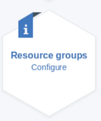
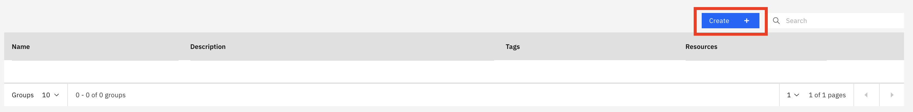
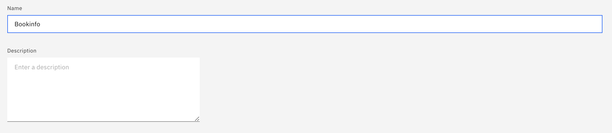
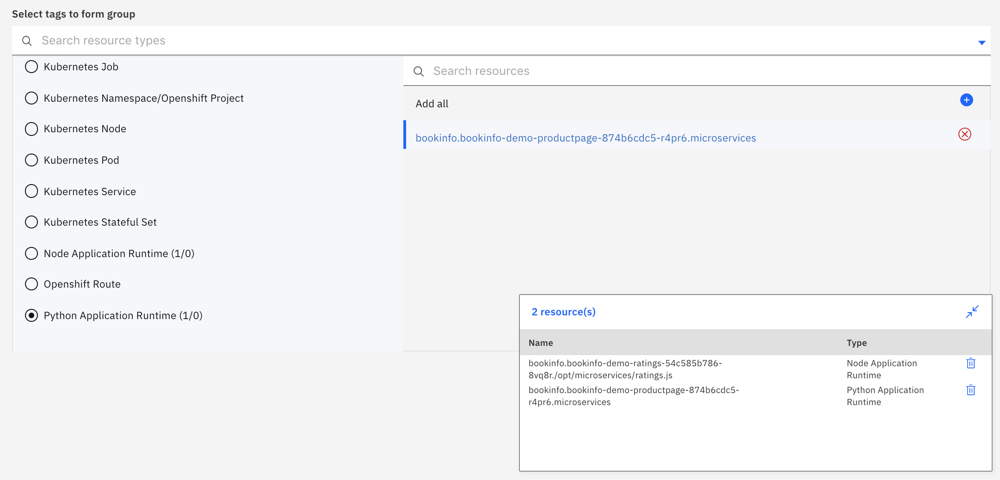
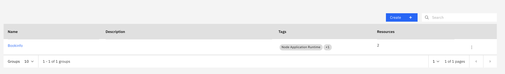
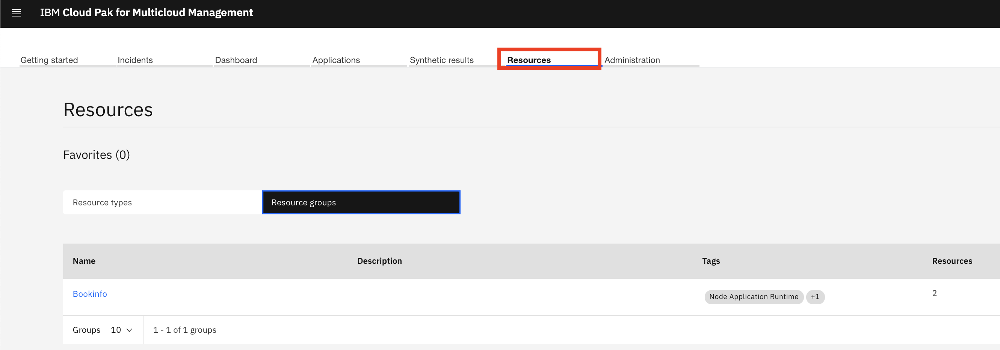
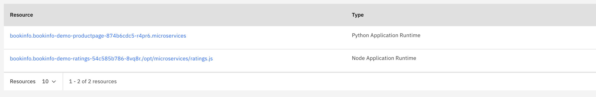

# Exercise 8 Creating a Resource Group

[Go back to the Table of Content](../../README.md)

Your monitored environment might have multiple managed resources that can be categorized by their purpose. Such resources often have the same threshold requirements. Use the Resource groups management page to organize managed resources into groups that you can easily and quickly access. You can also assign thresholds to resource groups for monitoring the managed resources of the same type that belong to the group.

To create a new Resource Group go to the Administration page:

Once there click on the Resource Groups tile:

In the Resource groups management page you will see that there are no resource groups configured yet.  We will create one for the Bookstore.  Select the “Create group” button:

In the window that opens give your group a name (no spaces allowed) and description (optional).

Scroll down to the next section titled “Select tags for form group”. In the Filters window, scroll down to the botton and select the “Node Application Runtime”, and in the window to the right you will see all  the corresponding resrouces. There is only one in this case so select that.  Next select the "Python Application Runtime" and then select the corresponding resource.  You will see a pop up window that lists all of the resources you have selected.

Once you are done select the “Create” button at the bottom.  You will now see your “Bookinfo” resource group listed, and you can access it from the Resources page.

Navigate to the Resources page. Select the "Resource groups" tab and you will see the Bookinfo group listed.  

Click on Bookinfo to see the resources that you added to it.

This concludes the exercise.

[Go back to the Table of Content](../../README.md)

<table>
  <tr>
    <td>Version</td>
    <td>1.0</td>
  </tr>
  <tr>
    <td>Author</td>
    <td>Sean Lombardo, IBM</td>
  </tr>
  <tr>
    <td>email</td>
    <td>sean.lombardo.ibm.com</td>
  </tr>
</table>
