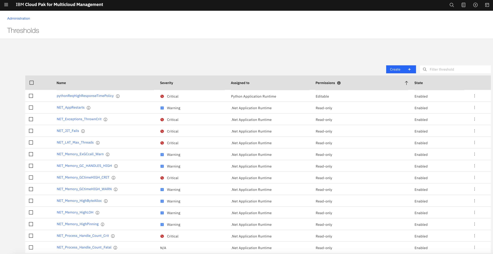
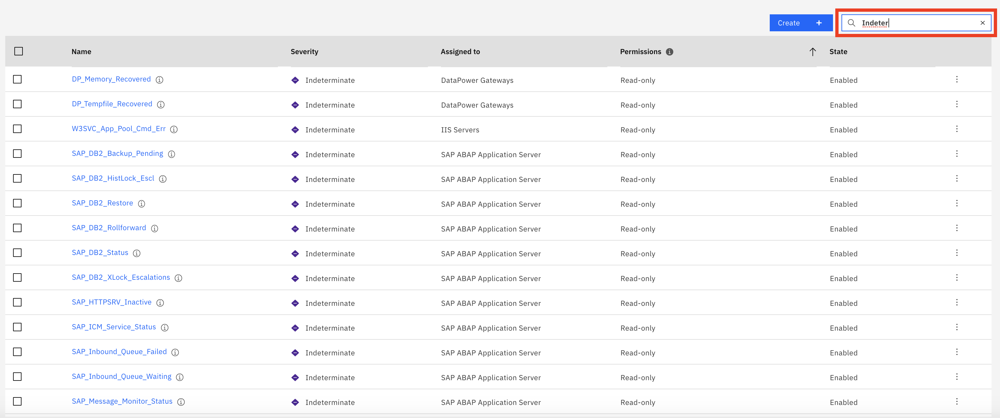
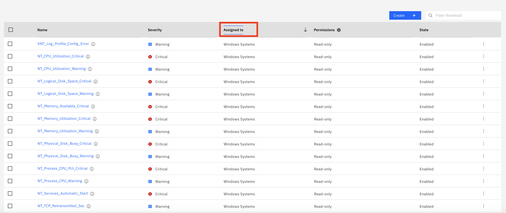
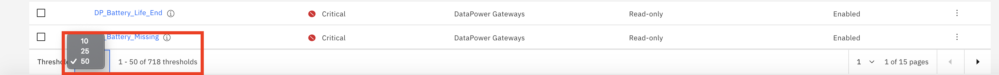
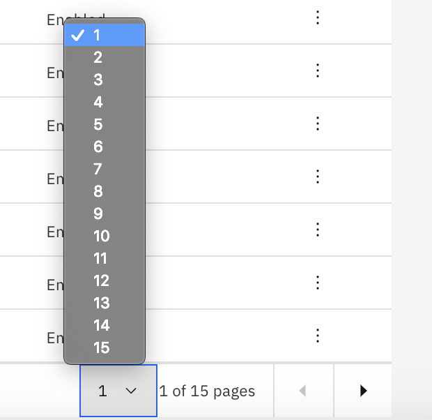
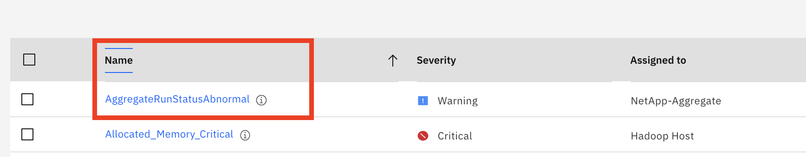
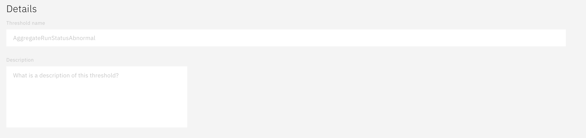
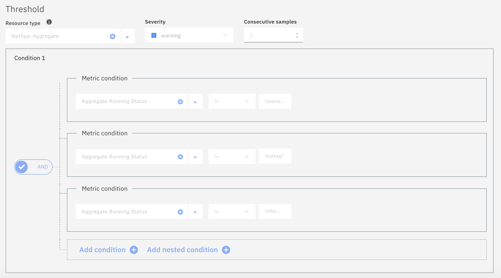
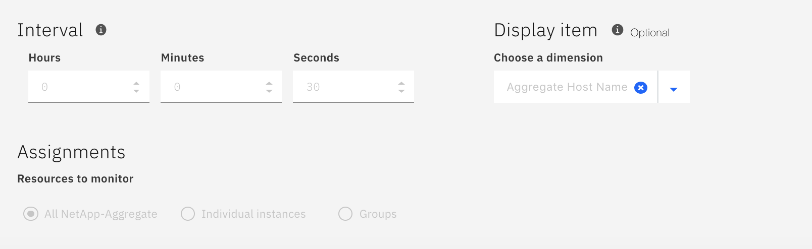
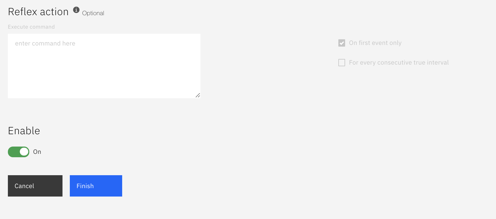

# Exploring Thresholds

[Go back to the Table of Contents](../../README.md)

Thresholds test for resource issues such as a slow response time. When the conditions of a threshold are true, an event is opened and an incident is generated. You can create, edit, delete, enable, or disable thresholds.

Go to the Administration page by clicking the link at the top of the page.

Then click the Thresholds tile.

In the Thresholds page you will see a list of all of the out of the box thresholds that come with ICAM.

The column headings for the Thersholds table are defined below:

•	**Name** is the title given to the threshold when it was saved. Click the name to view and change the     definition in the threshold editor page.

•	**Severity** is the severity that was chosen for the threshold.

•	**Assigned to** is the resource type that the threshold is defined to monitor, such as Linux Systems      or Kubernetes Service.

•	**Permissions** are either Read-only or Editable. Read-only thresholds are predefined or importe
from integrated sources and cannot be changed. Editable thresholds were created by a member of your team and you have full editing capability.

•	**State** is Enabled for thresholds that are operational, which means they are monitoring the             resources that they were assigned to. State is Disabled state when Enable has been turned off and     the threshold is non-operational.

If you're looking for a threshold that doesn't show on the first page of the table, you can use the page controls to help you more readily find what you're looking for.

Click inside the Filter text box and type the beginning of the value to filter by. As you type, the rows that do not fit the criteria are filtered out. For example, begin typing Indeterminate to filter the list down to only those thresholds with severity Indeterminate.

You can also select a column heading to sort by. Clicking the heading name once will sort in descending order, clicking a second time will sort in reverse order.  For example, alphabetically A-Z or Z-A.

At the bottom of the list you can select the number of thresholds to show per page: 10, 25, or 50.  This will help to prevent needing to scroll through several pages of results.

You can also select the next or previous page or a specific page number.

Now let's look at a threshold definition. Sort your thresholds by name, then click the first one in the list - AggregateRunStatusAbnormal for the NetApp-Aggregate resource.  This is a read-only threshold so you don't have to worry about making any inadvertant changes.  You will also notice that the definitions are greyed out.

In the Edit threshold page you will see that it is broken out into several sections.  The first section is Details, and in this section is where you give your threshold a name and an optional description.

The next section is Threshold where you define the conditions for generating the alert. First you choose your resource type, select a severity, and enter the number of consecutive samples it should evelaute before returning true.

Next you will add your condition(s).  You have the option of adding only one condition, or creating several and have them evaluate as And/Or, and also create nested conditions. Inthis case there are three And conditions all pertaining to Aggregate Running Status.

Under conditions is an optional section called Aggregate condition.  An aggregate condition would be applied to the results of the normal condition definition(s) and enable further granularity in threshold setting.

The next section has Interval, where you define how often the threshold will evaluate.  Next to Interval is Display item, which lets you assign a subject to your threshold.  This can only be used when the aggregate condition is not being used.

Below these is Assignments which is where you define what resource(s) this threshold will apply to.

The next ection is Reflex action, which is optional.  It provides the following capabilities:

### Execute command
After an event is opened for a threshold that is true, you can have a command or script of commands run automatically on the monitored system for which the event was opened. For example, you might want to log information or trigger an audible beep.

### On first event only checkbox
Select On first event only if the data set in a specific interval returns multiple rows of events and you want to run the command for only the first event in the first row in the data set. Clear the checkbox if you want run the command for every row in the data set that returns an event.

### For every consecutive true interval checkbox
Select For every consecutive true interval checkbox to run the command every time the threshold is true. Clear the checkbox to run the command when the threshold is true, and don't run the command again until the threshold is false, followed by another threshold that is true in the next interval.

Finally you have the Enable switch, with will turn the threshold on or off.  When you are done reviewing the page you can click the Cancel button.

This concludes the exercise.

[Go back to the Table of Contents](../../README.md)

<table>
  <tr>
    <td>Version</td>
    <td>1.0</td>
  </tr>
  <tr>
    <td>Author</td>
    <td>Sean Lombardo, IBM</td>
  </tr>
  <tr>
    <td>email</td>
    <td>sean.lombardo@ibm.com</td>
  </tr>
</table>

