For this synthetic test we are going to monitor the availability and response times of a REST API data source. 

## Accessing the Synthetic editor

**Navigation to Synthetics **

The synthetic editor is listed in the Administration tab at the top of the screen.  To navigate to the correct place, if not already in ICAM, first click the hamburger menu in the top left, select **“Monitor health”** then **"Infrastructure monitoring"** from the menu and then click on **“Administration”** in the resulting bar.

**Selecting Synthetics**

Once the screen loads you need to click on the area of interest. In this case **“Synthetics”**.

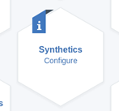

Click on the **“Create”** button 

**Title**

We are again going to build another synthetic test, but this time using an API REST interface.
First give the new test a name. 
Use any name you wish. I am going to use the name _“Pet Store – REST Availability”_ for this example.

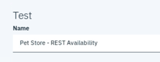

**Description**

Add a quick description of the monitoring you are setting up. This is optional, but it can be very useful for others that are reviewing the test configuration, or in the case of reviewing the test during an incident.

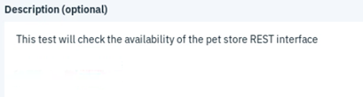

**Type of Synthetic test**

As we want to monitor a REST API we will select the **“REST API”** tile.

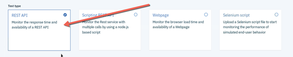

**Request Method**

For the request method we need to select the drop-down and click on **“GET”** as we want to get data in the response to our test.

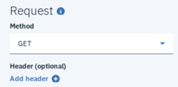

**Data source URL**

You can pick any REST API you want in this exercise. I have provided an external URL for a test API interface which will allow you to run the test and see the data coming back.  In the URL box type:

_https://petstore.swagger.io/v2/pet/findByStatus?status=available_

Note: If you want to see the data first before creating the test, enter the URL into a separate browser window and you can view its structure and information.

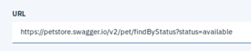

**Response validation**

Next, we are going to configure the warning and critical event thresholds for the test. 
NOTE: By default, a response time over 5 seconds will trigger a warning event and a response time over 10 seconds triggers a critical event. 

As this is a lab test feel free to leave or change the defaults. 

**Authentication**

Basic NTLM authentication (challenge-response authentication) is supported. This is also an optional field and we won’t need it for this test.

**Verifying test**

This button/step is used to verify the test configuration, Click the **“Verify Test”** button.

**Verification Complete**

This will produce a pop-box and can take a minute or two depending on the complexity of the script ICAM is checking. When the validation completes you will be presented with a pass or fail icon.

Green = pass
Red = fail – Should any of your verifications fail you can click on the **“Details”** option to see which part of the script ICAM has failed.

In our case this test should pass and you will be presented with a green check mark.

Click **“Next”** in the bottom right corner.

**Settings**

The next step is to set interval frequency of the synthetic test. In most production environments longer intervals are most likely, but as this is a lab and we want to generate some data quickly, set the interval to 1 minute.

With ICAM you can test from multiple locations around the globe. The **“Testing Frequency”** will allow you to either run the same synthetic test simultaneously from all the sites or stagger them. In this case leave **“Simultaneous”** selected.

**Locations**

This section will allow you to pick the sites from across the globe from which you wish to run the synthetic test from. You can pick a single site or multiple.

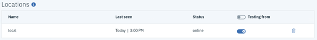

**Event Triggers**

This is where you can set whether a failed response triggers a critical alert. A failed response is when the test returns a code 400 or above.  For this exercise we are going to set the slider bar to “Off”.

You can also set how many times the test threshold is breached before the event is sent. Again, this is going to be left at “0” for this exercise.

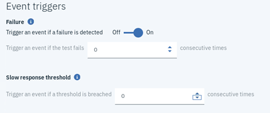

**Finish**

You have now completed the configuration of the REST API synthetic test. Click **“Finish”** in the bottom right corner of the screen

## Synthetic results

Now that you have created the synthetic test, it’s time to see how the API is performing. To do this you again will need to consult the Synthetic results dashboard. Here is how to navigate to that page.

Click the “Synthetic Results” at the top of the screen

You will now see all the Synthetic tests you have created. 

Select the script you just created by clicking on the blue name

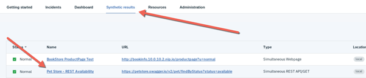

As before you can see the timeline, time period features, locations, and widgets as we have looked at in previous exercises.  For this exercise, review the data in these widgets to be familiar with what is returned. Once you have finished this review, scroll down to the “Test instance breakdown” widget on the page.

This widget will give you a wealth of information about the synthetic test that you have performed. 

At the top you will see each playback result in time order.  This high-level view will show you everything from the response time of each playback to the response code.

NOTE: You can set up an incident to be raised if an unexpected return code is issued.

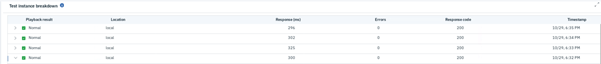

If you click the little arrow to the left of one of the playbacks, it will expand that test to show you the detailed data.

At the top you will see clear stat feedback on:
•	Response time
•	Redirect
•	Size
•	Download speed 
•	Errors seen

Then you have the stage breakdown of each of the stages of the test.  This is a great resource to see which part of the test the most time is spent should you be experiencing issues with your own environments. You can compare and contrast the results over time at a glance. This will allow you to see if this is a sudden change, or the response times have been growing slowly over time.

There is a visual representation of the test and also the time in milliseconds on the right-hand side of each of the stages.

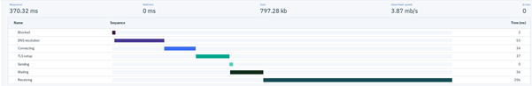

As we have used an external source as the URL. You are more likely to see changes in the results.  Remember you can use the first (top) widgets on this screen to review data such as the average times and percentage availability.